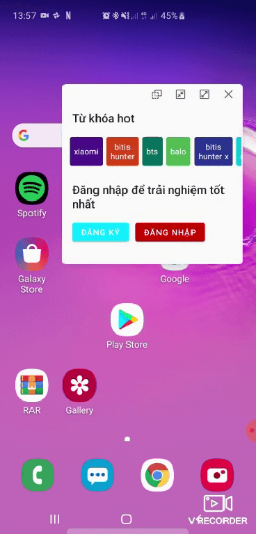

# Tiki Home Test

Home test project to apply for Android Developer position
## Table of contents
- [Demo](#demo)
- [Implemented functions](#implemented-functions)
- [The project architecture](#the-project-architecture)
- [The project has following packages](#the-project-has-following-packages)
- [Library reference resources](#library-reference-resources)
- [Note](#note)

## Demo

  
  &nbsp&nbsp&nbsp&nbsp&nbsp
  

## Implemented functions
- Fetch data from web server and display to screen
- Handle logic if be fail when fetch data
- Write Unit test, Ui test
- Implement algorithm to divide word if the keyword has more than 2 words

## The project architecture
MVVM

## The project has following packages
- **data**: It contains all the data accessing and manipulating components.
- **di**: Dependency providing classes using Dagger2.
- **screen**: View classes along with their corresponding ViewModel.
- **extension**: Utils classes.
- **test**: IdlingResource classes to support UI Test.

## Library reference resources
- RxJava2: https://github.com/ReactiveX/RxJava
- Dagger2: https://github.com/google/dagger
- Retrofit: https://github.com/google/dagger
- Android jetpack: https://github.com/google/dagger

## Note
- App can run smoothly, data be kept when config change, user can refresh data,...
- Project follow MVVM architecture, it's easy to maintain and add new features
